# CJM 대시보드 검토

## 검토 개요

- 검토 대상: 개발자 전달본 user-standalone.html, admin-standalone.html (2026-09-18 빌드, 제목 "AIDEVOPS-79 고객 여정 가이드 mock")
- 검토 방법: 두 파일을 로컬에서 실행, 사용자/관리자 화면의 전 기능(검색, 필터, 요청 4종, 승인/반려, 버전 확정/비교, 이력) 직접 조작
- 비교 기준: 현행 Vercel 대시보드와 구글시트 원장 (2026-09-30 GAS 조회 기준 L2 54, L3 167, L4 527건)
- 결론: 요청 접수, 승인, 버전 관리 흐름은 갖춰짐. 다만 mock 데이터 규모(L4 44건, 채널 1개)에 맞춰 설계된 화면 구조가 실제 원장(L4 527건, 복수 채널 129건)과 맞지 않아 **1장 3건은 개발 착수 전 결정 필요**
- 읽는 방법: 그림마다 바로 아래 표에 그 그림에 표시된 번호만 정리. 번호 체계는 1 최우선 결정, 2 사용자 화면, 3 관리자 화면, 4 공통 UI와 문구

## 1. 개발 착수 전 결정 필요 3건

| 번호 | 요약 | 그림 |
|---|---|---|
| 1-1 | L4 채널이 단일 선택. 실제 원장은 복수 채널 129건, ALL 38건, ALL(Digital) 31건 | 그림 3, 그림 4 |
| 1-2 | L1 6개 고정 6열 레이아웃. 실제 L1당 L4 88개 수준이라 열이 지나치게 길고 명칭 잘림 | 그림 2, 그림 9 |
| 1-3 | 코드 체계와 L1 명칭이 실제 원장과 다름. KPI 시트가 L4 코드로 연결되어 재발번 금지 | 그림 2 |

## 2. 사용자 화면

### 그림 1. 사용자 헤더와 필터 바

붉은 번호 2-4, 2-12, 4-1, 4-4, 4-5, 2-1 표시. 이 중 2-1은 다른 그림 표에서 설명

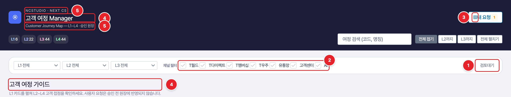

| 번호 | 위치 | 확인된 현상 | 문제 | 수정 제안 |
|---|---|---|---|---|
| 2-4 | 필터 바 우측 "검토대기" | 텍스트처럼 보이나 토글 버튼. 켜면 검토대기 항목만 남고 펼침 상태가 "전체 접기"로 바뀜 | 버튼임을 알 수 없고, 켜짐 상태 표시도 약함. 사용자 화면에서는 남의 요청 대기 건까지 보임 | 체크박스 또는 칩 형태로 변경, 켜짐 상태 색상 명확화. 사용자 화면에서는 "내 요청 대기" 로 범위 한정 검토 |
| 2-12 | 버전 표시 | 사용자 화면에 현재 보는 원장이 어느 버전인지 표시 없음. 관리자는 "v1.2 편집 중" 선택 가능 | 사용자가 보는 것이 확정본(v1.1)인지 편집 중 원장(v1.2)인지 정의 필요. 푸터 문구는 편집 중 원장을 보는 것으로 읽힘 | 사용자 화면 기준을 확정본으로 할지 결정 후 헤더에 버전 표기 |
| 4-1 | 아이콘 | L1 아이콘(↗ ⌕ ▣ ⚙ ↑ ↘), 헤더(▧), 행 액션(＋ ✎)이 모두 문자 기호. 굵기와 크기가 제각각 |  | 포털 공통 아이콘 세트로 교체 |
| 4-4 | 명칭 통일 | 브라우저 제목 "고객 여정 가이드", 헤더 "고객 여정 Manager", 본문 제목 사용자 "고객 여정 가이드", 관리자 "고객 여정 원장" |  | 서비스명 하나로 통일 (예: 고객 여정 Manager), 본문은 "여정 지도" 로 통일 |
| 4-5 | 헤더 문구 | "NCSTUDIO · NEXT CS", "Customer Journey Map — L1~L4 · 승인 원장" |  | 포털 내 메뉴로 들어가므로 브랜드 라벨 제거, 부제는 한국어 한 줄 |

### 그림 2. 사용자 여정 지도, 전체 펼침 상태

붉은 번호 1-2, 1-3, 2-5, 2-9, 2-11, 4-2, 4-1 표시. 이 중 4-1은 다른 그림 표에서 설명

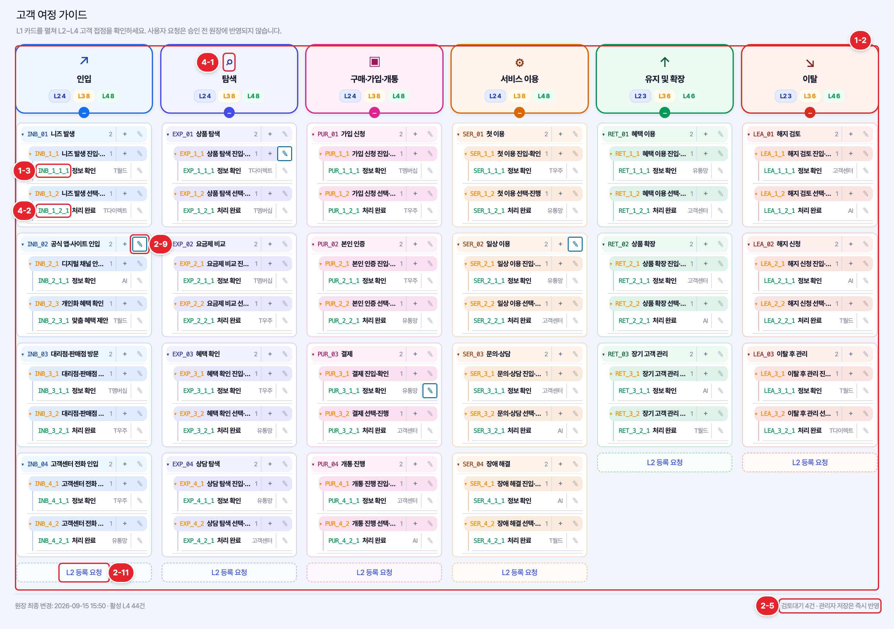

| 번호 | 위치 | 확인된 현상 | 문제 | 수정 제안 |
|---|---|---|---|---|
| 1-2 (최우선) | 여정 지도 본문 레이아웃 | L1 6개를 고정 6열로 배치, 1440px에서 열 폭 약 230px, 1024px에서 216px | 실데이터는 L1당 L2 9개, L4 88개 수준. 한 열에 세로로 100행 이상 쌓이고, mock의 짧은 명칭도 이미 말줄임 처리됨 ("공식 앱·사이트 인입 진입·확인" 잘림) | L1 카드 6개는 상단에 요약으로 두고, 펼친 L1은 전체 폭을 쓰는 구조로 변경. 또는 현행 Vercel 대시보드처럼 L1을 탭/아코디언으로 하나씩 펼치는 방식 검토 |
| 1-3 (최우선) | 원장 데이터 이관 | mock 코드 체계 INB_01, INB_1_1, INB_1_1_1. L1 명칭 "구매·가입·개통" (가운뎃점) | 실제 원장 코드는 ent_need, ent_need_ad, ent_need_ad_01 형식, L1 명칭은 "구매/가입/개통" (빗금). KPI 시트가 L4 코드로 연결되어 있어 코드가 바뀌면 KPI 매핑 깨짐 | 구글시트 원장 527행을 코드, 명칭, 채널 그대로 이관. 코드 재발번 금지. 기존 검토_요청 탭 이력(REQ_001~055, 대기 2건) 이관 여부 결정 필요 |
| 2-5 | 하단 푸터 | "검토대기 4건 · 관리자 저장은 즉시 반영" | 사용자에게 관리자 저장 방식은 불필요한 정보. 상단 "내 요청 1"과 숫자가 달라 혼선 | 사용자 푸터는 "원장 기준 버전 v1.1, 최종 변경 일시" 로 교체 |
| 2-9 | 대기 중 항목의 연필 아이콘 | 검토대기 요청이 있는 행은 연필이 파란 테두리로 바뀌고, 클릭 시 새 요청 대신 기존 요청 상세가 열림 | 의미를 설명하는 범례나 툴팁 없음. 다른 사람이 대기 중이면 내 수정 요청을 낼 수 없는 구조인지 확인 필요 | 행에 "검토대기" 배지 별도 표시, 아이콘 툴팁 추가. 동일 항목 중복 요청 정책 명시 |
| 2-11 | L2 등록 요청 버튼 | 각 열 최하단 | 실데이터에서는 L2 9개 아래에 위치, 스크롤 끝까지 내려야 보임 | L1 카드 안 또는 열 상단에도 배치 |
| 4-2 | 글자 크기 | 여정 카드 내부 10px, 11px, 12px 혼용 |  | 최소 12px, 본문 13px 이상 |

### 그림 3. L4 등록 요청 모달, 빈 값으로 제출한 직후

붉은 번호 1-1, 2-7, 4-6 표시

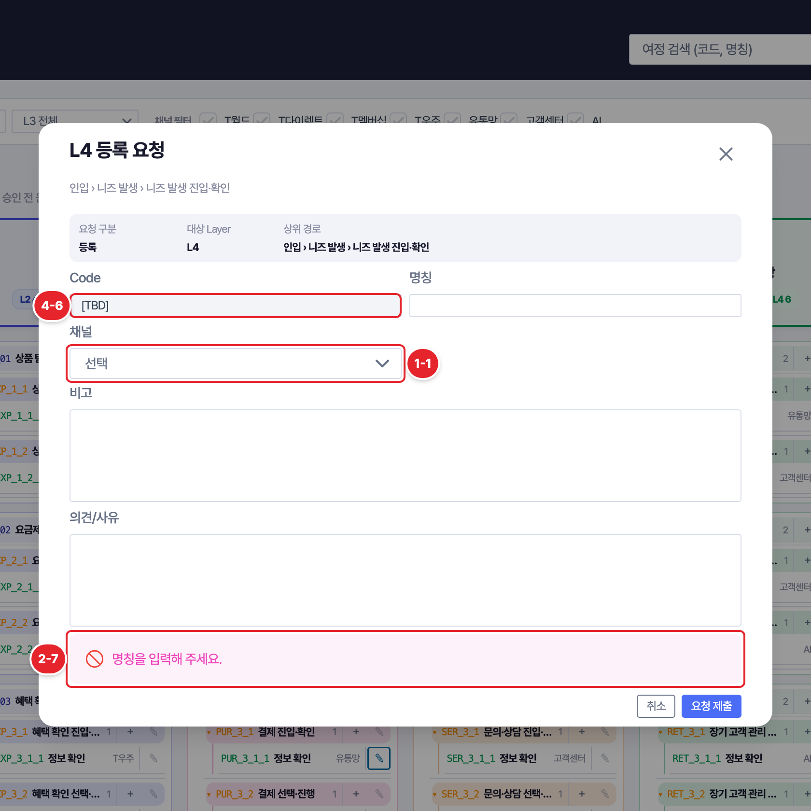

| 번호 | 위치 | 확인된 현상 | 문제 | 수정 제안 |
|---|---|---|---|---|
| 1-1 (최우선) | L4 채널 입력 (사용자 등록/수정 요청, 관리자 수정 공통) | 채널이 단일 선택 드롭다운 (선택, T월드, T다이렉트, T멤버십, T우주, 유통망, 고객센터, AI 중 1개) | 실제 원장 L4 527건 중 복수 채널 129건, ALL 38건, ALL(Digital) 31건, 빈값 26건. 현 구조로는 원장 이관 불가 | 채널 복수 선택(체크박스 또는 멀티 셀렉트)으로 변경. ALL, ALL(Digital)은 별도 값으로 유지할지 채널 전체 선택으로 풀지 결정 필요 |
| 2-7 | 요청 모달 필수 입력 | 명칭, 의견/사유가 필수이나 라벨에 표시 없음. 제출 후 하단에 "명칭을 입력해 주세요" 표시 | 제출 전에는 무엇이 필수인지 알 수 없음 | 필수 라벨에 별표, 미입력 필드 테두리 강조 |
| 4-6 | 용어 | "원장", "승인 원장", "Layer", "Code [TBD]" |  | 사용자 화면은 "여정 지도", "단계(L1~L4)", 코드 입력란은 "관리자가 부여" 로 안내 |

### 그림 4. L4 수정 요청 모달

붉은 번호 2-6, 1-1 표시. 이 중 1-1은 다른 그림 표에서 설명

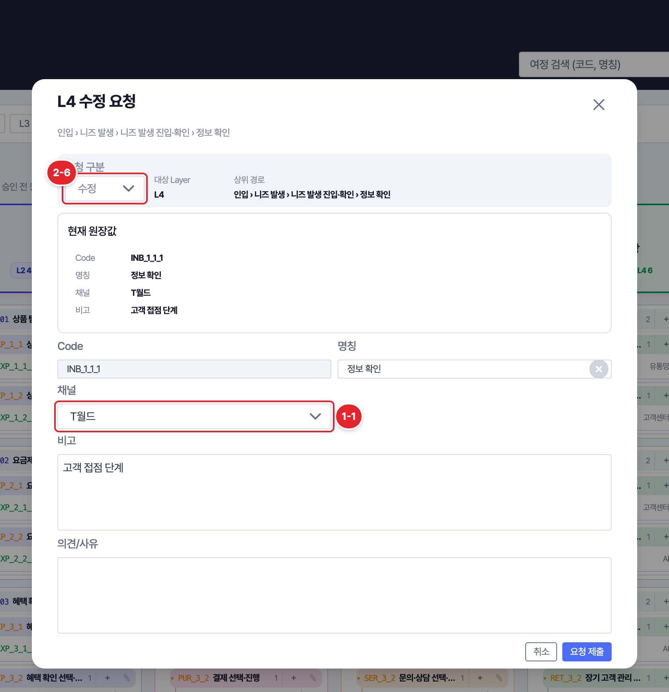

| 번호 | 위치 | 확인된 현상 | 문제 | 수정 제안 |
|---|---|---|---|---|
| 2-6 | 삭제 요청 진입 | 수정 요청 모달 안의 "요청 구분" 드롭다운을 수정에서 삭제로 바꿔야 삭제 요청 가능 | 삭제 요청 경로가 숨겨져 있음. 현행 대시보드는 "삭제 제안"이 별도 선택지 | 행 메뉴에 "삭제 요청"을 별도 항목으로 노출하거나, 모달 상단에 수정/삭제 라디오로 변경 |

### 그림 5. 내 요청 상세

붉은 번호 2-8 표시

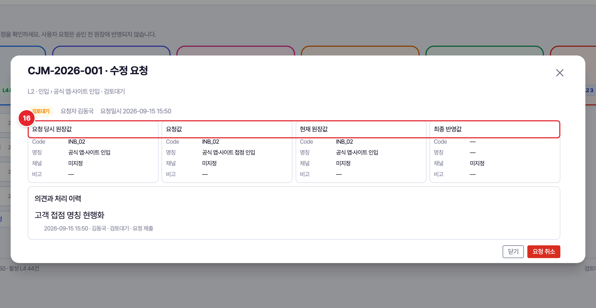

| 번호 | 위치 | 확인된 현상 | 문제 | 수정 제안 |
|---|---|---|---|---|
| 2-8 | 내 요청 상세 | 요청 당시 원장값, 요청값, 현재 원장값, 최종 반영값 4열을 나란히 표시. 어느 필드가 바뀌었는지 강조 없음. L2/L3 요청에도 "채널 미지정" 행 표시 | 사용자에게는 "무엇을 어떻게 바꿔달라 했고 지금 어떤 상태인지"만 필요. 채널은 L4에만 있는 속성 | 사용자 화면은 요청값과 현재값 2열, 변경 필드만 색상 강조. 채널 행은 L4에서만 표시 |

### 그림 6. L1 필터로 인입만 선택한 상태

붉은 번호 2-2 표시

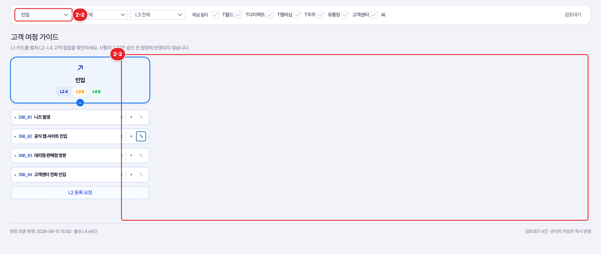

| 번호 | 위치 | 확인된 현상 | 문제 | 수정 제안 |
|---|---|---|---|---|
| 2-2 | L1 필터 선택 | L1 "인입" 선택 시 인입 카드 1열만 좁게(약 190px) 남고 나머지 5열은 빈 공간 | 필터로 범위를 좁힐수록 화면이 더 좁아지는 역효과 | 1-2와 함께 해결. 필터 결과가 1개 L1이면 전체 폭 사용 |

### 그림 7. "결제" 검색 결과

붉은 번호 2-3 표시

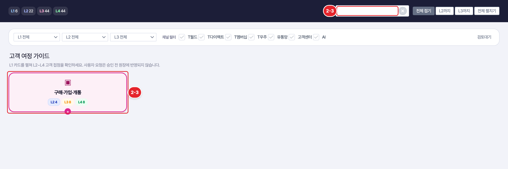

| 번호 | 위치 | 확인된 현상 | 문제 | 수정 제안 |
|---|---|---|---|---|
| 2-3 | 검색 | "결제" 검색 시 L2 결제 행만 접힌 상태로 표시, 하위 L3/L4 미노출 | 검색 후 다시 펼쳐야 내용 확인 가능 | 검색 결과는 일치 항목까지 자동 펼침, 일치 문자열 강조 |

### 그림 8. 채널 필터에서 T월드를 한 번 클릭한 상태

붉은 번호 2-1 표시

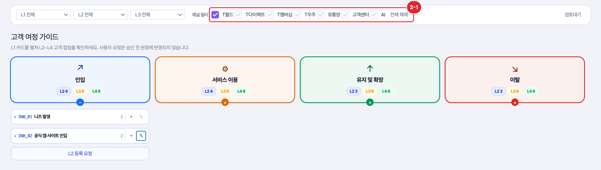

| 번호 | 위치 | 확인된 현상 | 문제 | 수정 제안 |
|---|---|---|---|---|
| 2-1 | 채널 필터 체크박스 | 전체 체크 상태에서 T월드 하나를 클릭하면 T월드만 남고 나머지 6개가 해제됨 ("전체 해제" 버튼 등장) | 체크를 끄려는 조작이 반대 결과를 냄. 체크박스 모양인데 동작은 단독 선택 | 클릭은 해당 채널만 토글. 단독 선택은 별도 "이 채널만" 동작으로 분리하거나 제거 |

### 그림 9. 1024px 폭에서 본 사용자 화면

붉은 번호 4-3, 1-2 표시. 이 중 1-2은 다른 그림 표에서 설명

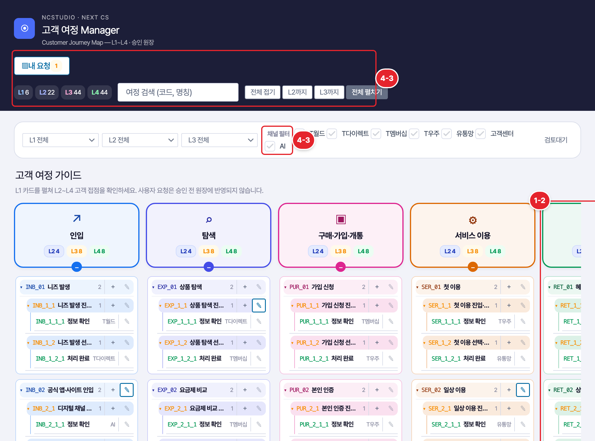

| 번호 | 위치 | 확인된 현상 | 문제 | 수정 제안 |
|---|---|---|---|---|
| 4-3 | 1024px 폭 | 채널 필터가 두 줄로 꺾이며 "AI"만 둘째 줄에 남음. 헤더가 두 단으로 재배치되고 지도는 가로 스크롤 |  | 1280px 이하 대응 규칙 정의. 채널 필터는 접힘 또는 드롭다운 |

## 3. 관리자 화면

### 그림 10. 관리자 메인

붉은 번호 3-1, 3-6, 4-7, 3-9 표시. 이 중 3-9은 다른 그림 표에서 설명

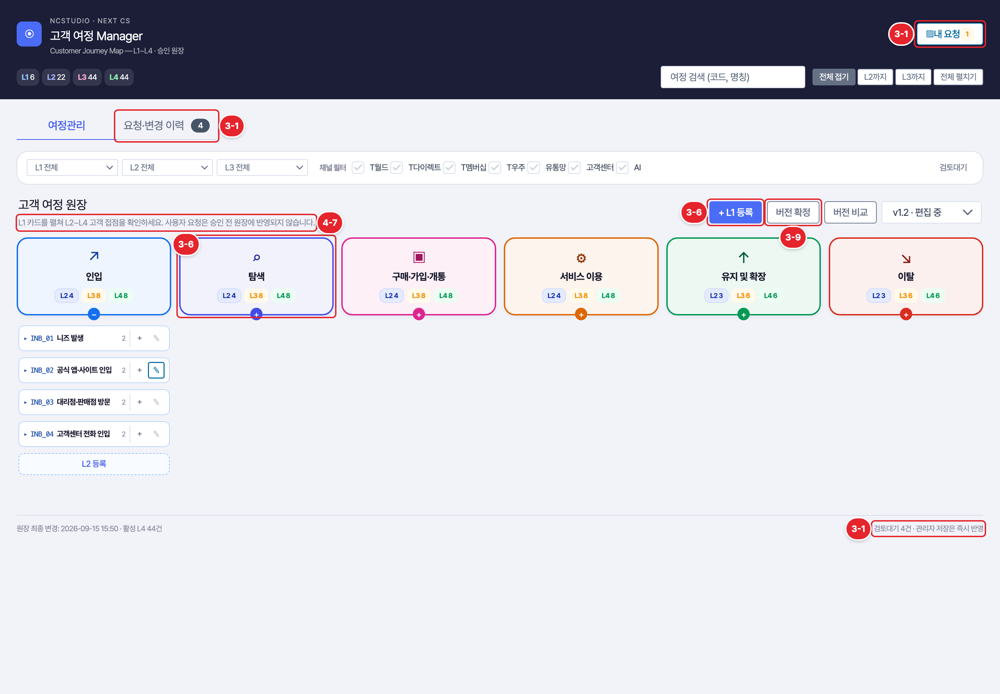

| 번호 | 위치 | 확인된 현상 | 문제 | 수정 제안 |
|---|---|---|---|---|
| 3-1 | 헤더 "내 요청" 버튼 | 관리자 화면에도 "내 요청 1" 버튼 존재. 하단 푸터 "검토대기 4건", 탭 배지 "4" 와 함께 숫자 3종 | 관리자에게 필요한 것은 처리 대기 건수 하나 | "내 요청" 제거 또는 "요청 관리" 로 통합, 대기 건수는 탭 배지 하나로 통일 |
| 3-6 | L1 관리 | "+ L1 등록"만 있고 L1 카드에 수정/삭제 버튼 없음. 등록 모달 입력은 명칭, 비고, 변경 사유뿐 | L1 아이콘, 색상, 순서를 어디서 정하는지 없음 | L1 수정/삭제/순서 변경 경로 추가, 아이콘·색상 지정 방식 결정 |
| 4-7 | 안내 문장 | 사용자/관리자 동일 문구 "L1 카드를 펼쳐 L2~L4 고객 접점을 확인하세요. 사용자 요청은 승인 전 원장에 반영되지 않습니다." |  | 관리자 화면은 "관리자 저장은 즉시 반영, 사용자 요청은 승인 후 반영" 으로 구분 |

### 그림 11. 관리자 승인 처리 모달

붉은 번호 3-2, 3-3, 3-4 표시. 이 중 3-4은 다른 그림 표에서 설명

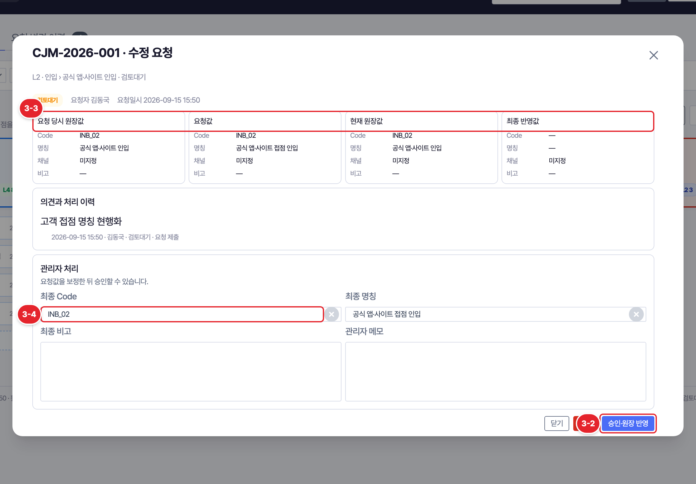

| 번호 | 위치 | 확인된 현상 | 문제 | 수정 제안 |
|---|---|---|---|---|
| 3-2 | 승인 처리 | "승인·원장 반영" 1회 클릭으로 즉시 반영, 확인 단계 없음. 상단 성공 배너는 닫기 전까지 유지 | 원장에 바로 쓰이는 동작이므로 오클릭 방지 필요 | 반려와 동일하게 2단계(확인) 처리. 성공 배너는 수 초 후 자동 닫힘 |
| 3-3 | 승인 상세 4열 비교 | 사용자 화면과 동일하게 변경 필드 강조 없음. mock 요청 CJM-2026-002는 요청값과 현재값이 완전히 같음 | 승인자가 바뀐 필드를 눈으로 찾아야 함 | 변경 필드 색상 강조, 변경 없음이면 "변경 없음" 경고 |

### 그림 12. 관리자 L2 직접 수정 모달

붉은 번호 3-4, 3-5 표시

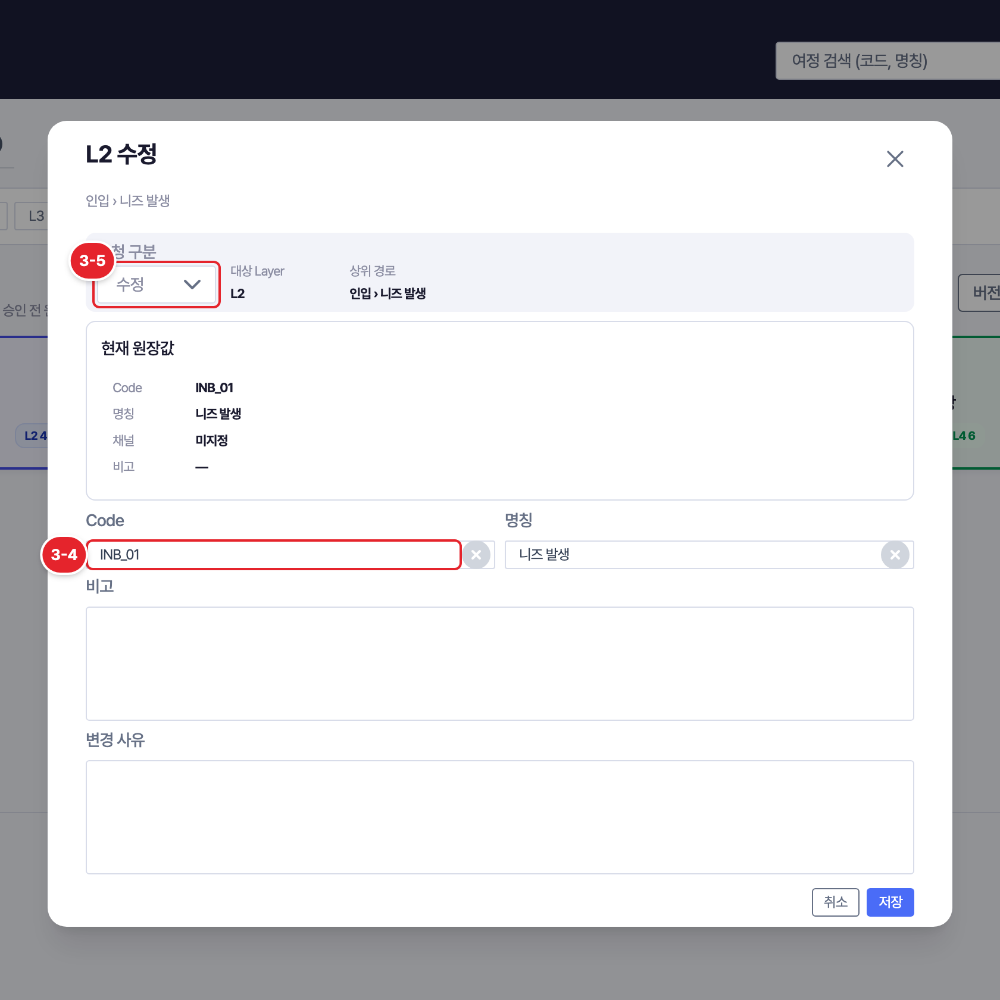

| 번호 | 위치 | 확인된 현상 | 문제 | 수정 제안 |
|---|---|---|---|---|
| 3-4 | 직접 수정 모달 Code 입력 | 기존 항목의 Code(INB_01)를 자유 수정 가능. 승인 화면의 "최종 Code"도 수정 가능 | 코드는 KPI 시트 등 외부 연결 키. 변경 시 연결 끊김 | 기존 항목 Code는 읽기 전용. 변경이 꼭 필요하면 별도 "코드 변경" 기능으로 분리하고 경고 |
| 3-5 | 직접 삭제 진입 | 2-6과 동일하게 수정 모달 안 드롭다운에서 삭제 선택 | 관리자 삭제 경로도 숨겨져 있음 | 행 메뉴에 삭제 별도 노출, 하위 항목 수 포함 경고 (사용자 삭제 요청 모달의 경고 문구 재사용) |

### 그림 13. 요청·변경 이력 탭

붉은 번호 3-7, 3-8 표시

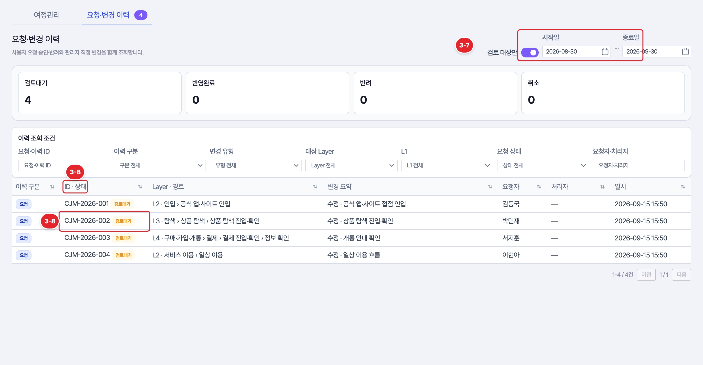

| 번호 | 위치 | 확인된 현상 | 문제 | 수정 제안 |
|---|---|---|---|---|
| 3-7 | 요청·변경 이력 탭 | "검토 대상만" 기본 켜짐이라 반영완료 행이 목록에서 빠지는데 상단 카드는 반영완료 1 표시. 기간 기본값 최근 1개월 | 카드 숫자와 목록이 불일치. 1개월 넘은 대기 건이 기본 화면에서 사라질 위험 | 기본은 전체 표시, 검토대기는 기간 무관하게 항상 표시 |
| 3-8 | 이력 테이블 | ID 열 안에 상태 배지가 함께 들어감. 행 텍스트가 연한 회색 | 상태 정렬/필터 불편, 가독성 저하 | 상태를 별도 열로 분리, 본문 텍스트 명도 상향 (확인 필요: 의도된 스타일인지) |

### 그림 14. 버전 확정 모달

붉은 번호 3-9 표시

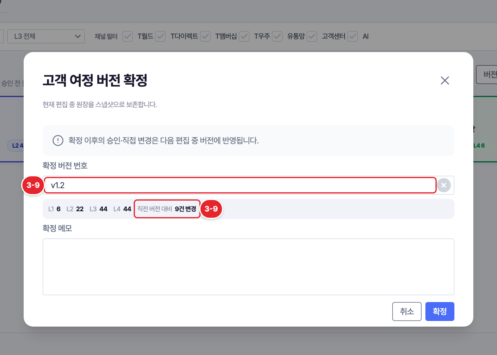

| 번호 | 위치 | 확인된 현상 | 문제 | 수정 제안 |
|---|---|---|---|---|
| 3-9 | 버전 확정 모달 | 버전 번호가 자유 입력 텍스트(v1.2). "직전 버전 대비 9건 변경" 표시는 있으나 내역 보기 링크 없음 | 번호 오타 가능, 확정 전 내역 확인은 별도 "버전 비교" 를 열어야 함 | 버전 번호 자동 채번, 모달 안에 "변경 내역 보기" 링크 |

### 그림 15. 확정 버전(v1.1) 조회 화면

붉은 번호 3-10 표시

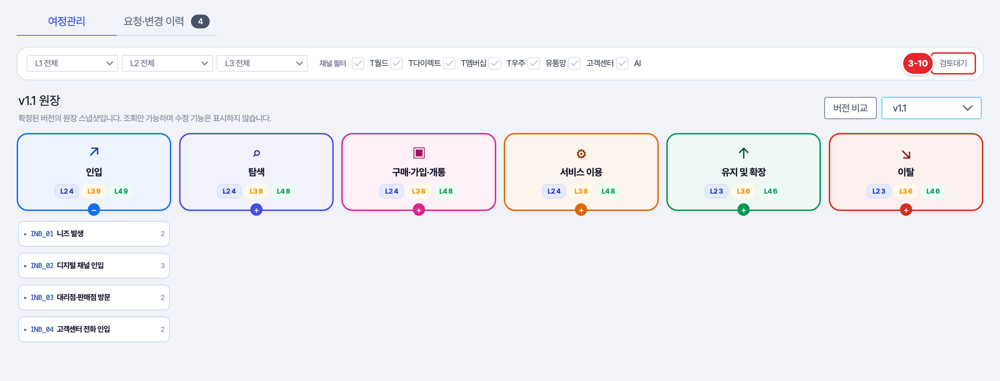

| 번호 | 위치 | 확인된 현상 | 문제 | 수정 제안 |
|---|---|---|---|---|
| 3-10 | 확정 버전 조회(v1.1) | 읽기 전용 안내 배너와 수정 버튼 숨김은 잘 됨. 필터 바의 "검토대기" 토글은 그대로 노출 | 스냅샷에는 검토대기 개념이 없음 | 확정 버전 조회 시 검토대기 토글 숨김 |

## 4. 그림 없는 항목

| 번호 | 위치 | 확인된 현상 | 문제 | 수정 제안 |
|---|---|---|---|---|
| 2-10 | 자유 의견 | 현행 대시보드의 "의견 남기기"(특정 항목에 묶이지 않는 일반 요청) 없음. 실제 검토_요청 탭에 유형 "일반" 요청 존재 | 항목 지정이 어려운 제안(예: L1 구조 자체 의견)을 낼 경로 없음 | 헤더에 "의견 보내기" 추가 여부 결정 |

## 5. 개발자 확인 요청

- 사용자 화면이 보는 원장은 확정본인지 편집 중 원장인지 (2-12)
- 같은 항목에 검토대기 요청이 있을 때 다른 사용자의 요청 접수 가능 여부 (2-9)
- 채널 값 ALL, ALL(Digital) 처리 방식 (1-1)
- 구글시트 원장 527행과 검토_요청 이력 이관 계획, 코드 유지 여부 (1-3)
- 관리자 직접 변경 건이 요청·변경 이력 탭에 "변경" 구분으로 쌓이는지 (mock에 사례 없어 미확인)
- 승인 취소(반영 롤백) 가능 여부. 불가하면 3-2 확인 단계 필수
- KPI 대시보드 바로가기 링크 유지 여부 (현행 헤더 링크 없음)

## 6. 유지할 점

- 요청 4종(등록, 수정, 삭제, 취소)과 상태 4종(검토대기, 반영완료, 반려, 취소) 체계 명확
- 삭제 요청 모달의 하위 항목 동반 삭제 경고 문구
- 요청 취소, 반려의 2단계 확인 처리
- 확정 버전 조회 시 읽기 전용 안내와 수정 기능 숨김
- 버전 비교의 L2 단위 그룹, 등록/수정/삭제 건수 요약, Before/After 표시
